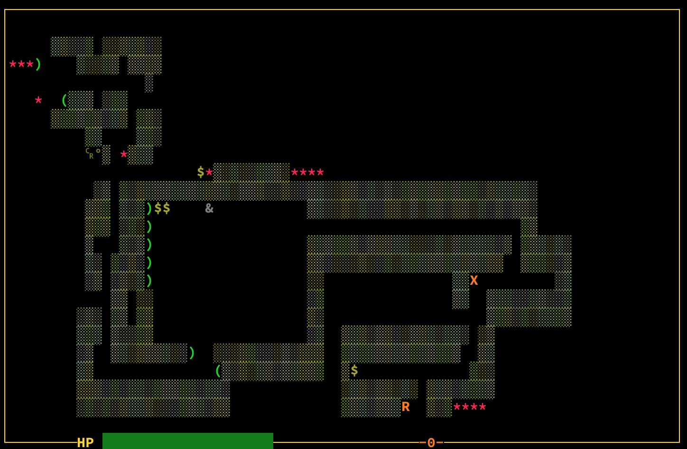

Dungeon Adventure
=================

A classic adventure game for the CP/M terminal written in Turbo Pascal.
Find the treasure, kill the monsters, explore the dungeon.

This is a little bit of a modernized take on classic adventure games.  It
relies on a fairly fast terminal and that it be a modern one that supports 256
colors.

You explore a dungeon of unknown depth and appearance, armed only with your
torch, your sword, and your wits! Can you survive?



Controls
--------

Use the following controls:

```
	h -> left
	l -> right
	k -> up
	j -> down

	x -> attack!

	q -> quit the game
```

Copyright (c) 2022 Karl Matthias
